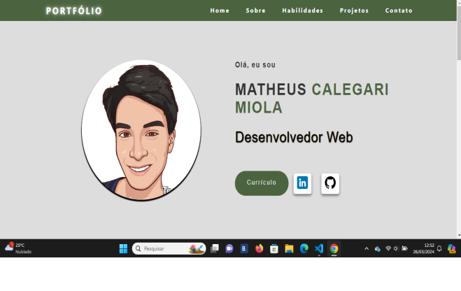

# Meu Portfólio

Este portfólio foi criado com intuito de demonstrar minhas habilidades e as que serão adquiridas ao longo dos anos, assim como meus projetos e futuros projetos e as melhorias que serão feitas.

## Tecnologias Utilizadas

- HTML5

- CSS3

- JavaScript

## Ferramentas De Desenvolvimento

- Visual Studio Code

- Git

- GitHub

## Projetos Destacados Neste Portfólio

- Projeto Next: Este projeto simula uma página de uma empresa fictícia que oferece serviços de provedores de internet chamada NEXT. A Página foi desenvolvida utilizando HTML, CSS e Javascript, possuindo também um arquivo responsivo para se adaptar a dispositivos mobile.
 
- Clone da Página de Login do Instagram: Este projeto é um clone da página de login do Instagram, desenvolvido utilizando HTML, CSS e um design responsivo para versão mobile.

## Contato

- E-mail: matheus.c.miola@outlook.com

- LinkedIn: http://www.linkedin.com/in/matheus-calegari-miola4226a1228/

- GitHub: https://github.com/Matheus-Calegari-Miola

## Futuras Melhorias

Haverão melhorias e expansão desse projeto em um futuro próximo.

## Autor

 Matheus Calegari Miola